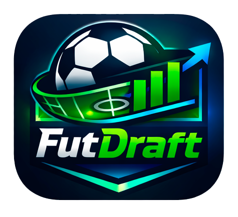

<div align="center">



# FutDraft

### A automação que faltava pro seu rachão


</div>

---

## Por que criei isso?

Toda semana o mesmo problema: o rachão começa, os times ficam desequilibrados, o time "apeIão" vence tudo, ninguém sente graça, e a galera vai embora sem querer voltar na semana seguinte.

Resolvi isso escrevendo código.

Desenvolvi o **FutDraft** por dois motivos que andam juntos: queria praticar minha lógica de programação e aprofundar meu conhecimento em JavaScript puro — e precisava resolver um problema real da minha vida. Sem biblioteca de terceiros pra fazer o trabalho pesado, sem framework, sem atalho. HTML, CSS e JS do zero, página por página, lógica por lógica.

O resultado é uma aplicação web mobile-first que gerencia o rachão completo: do sorteio dos times até o placar final, com ranking e artilheiro no fim.

---

## Como funciona

O FutDraft é dividido em **5 telas** que formam um fluxo contínuo do início ao fim do rachão.

```
Configuração → Sorteio → Jogo → Resultado → Resumo
```

### 1. Configuração

Você define as regras antes de qualquer coisa:

- **Tipo de sorteio** — Aleatório (puro acaso) ou Balanceado (equilibra por nível)
- **Jogadores** — Adiciona cada um com seu nível: A, B ou C
- **Estrutura** — Quantos por time (5x5, 6x6, 7x7) e quantos times (2, 3 ou 4)
- **Tempo** — Duração de cada partida em minutos

### 2. Sorteio

Os times são montados automaticamente e o primeiro confronto é sorteado. Você vê os cards de cada time com os jogadores dentro antes de começar.

### 3. Jogo

Tela ao vivo com:
- Cronômetro regressivo
- Placar em tempo real
- Registro de gol por jogador (time + nome do jogador)
- Botão para encerrar a partida quando quiser

### 4. Resultado

Mostra o placar final, quem venceu (ou empate) e qual o próximo confronto — tudo calculado automaticamente pela lógica de fila de times.

### 5. Resumo

Fim do torneio. Exibe o campeão, a classificação geral de todos os times e o artilheiro do dia.

---

## A lógica por baixo (explicada sem enrolação)

### Sorteio Balanceado

Imagine que você tem uma fila de jogadores ordenada do melhor para o pior. Os nível A ficam na frente, os B no meio, os C no final. Agora imagine que você vai distribuindo essa fila como se estivesse dando cartas numa mesa: um pro Time 1, um pro Time 2, um pro Time 3, volta pro Time 1... assim por diante.

O resultado é que cada time recebe uma mistura proporcional de bons, medianos e fracos — ninguém fica com todos os craques e ninguém fica com todos os piores. Times equilibrados sem discussão.

> No modo aleatório, a fila é embaralhada antes de distribuir. Mesmo processo, só que sem a ordenação por nível — pura sorte.

---

### Fila de Times (rodízio de partidas)

Pensa numa mesa de sinuca. Quem ganha fica. Quem perde levanta e vai esperar a vez no banco. O próximo da fila entra pra jogar contra quem ganhou.

No FutDraft é exatamente isso: ao encerrar uma partida, o **vencedor fica** em campo, o **perdedor vai pro final da fila** de espera, e o **próximo time da fila entra** como desafiante. Em caso de empate com times esperando, os dois saem e os dois próximos da fila entram — ninguém fica parado à toa.

---

### Cronômetro

Nada de mágica. O tempo que você configurou vira uma contagem regressiva em segundos. A cada segundo ele desconta um, atualiza o display e para quando chega a zero. Você também pode pausar, retomar e resetar a qualquer momento.

---

### Registro de Gol e Estatísticas

Cada gol registrado é salvo com o nome do jogador e o time. É como uma caderneta que vai sendo preenchida durante o torneio inteiro. No final, a aplicação lê essa caderneta, soma os gols de cada jogador e descobre quem foi o artilheiro — e lê os resultados das partidas pra montar o ranking de times.

---

### Memória entre as telas (LocalStorage)

A aplicação não tem servidor. Toda a informação — jogadores, configuração, placar, histórico de partidas — fica salva no próprio navegador usando o `localStorage`. É como um bloco de notas que o navegador guarda pra você enquanto o torneio acontece. Quando você reinicia o draft, o bloco é apagado e tudo começa do zero.

---

## Estrutura do projeto

```
futdraft/
├── index.html              # Landing page
├── pages/
│   ├── config.html         # Configuração do rachão
│   ├── sorteio.html        # Resultado do sorteio
│   ├── jogo.html           # Tela ao vivo (placar + cronômetro)
│   ├── resultado.html      # Resultado da partida + próximo jogo
│   └── resumo.html         # Encerramento e ranking final
├── assets/
│   ├── css/                # Estilos por tela
│   ├── js/                 # Lógica por tela
│   └── img/                # Imagens e ícones
```

---

## Como rodar

É HTML puro. Sem instalação, sem build, sem dependência.

1. Clone o repositório
2. Abra o `index.html` no navegador

```bash
git clone https://github.com/Dlima15/futdraft.git
cd futdraft
# abra index.html no seu navegador
```

> Recomendado: use a extensão **Live Server** no VS Code para melhor experiência durante o desenvolvimento.

---

## Tecnologias

| Tecnologia | Uso |
|---|---|
| HTML5 | Estrutura das telas |
| CSS3 | Estilização, animações, layout responsivo |
| JavaScript | Toda a lógica da aplicação |
| LocalStorage | Persistência de dados entre telas |

Sem frameworks. Sem bibliotecas de lógica. Propositalmente.

---

<div align="center">

Desenvolvido por **Danilo Lima**

</div>
